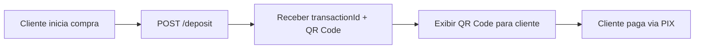

# Documentação API Gateway - Alfred P2P

**Versão:** 2.0  
**Última Atualização:** Novembro 2025

---

## Índice

1. [Visão Geral](#visão-geral)
2. [Autenticação](#autenticação)
3. [Endpoints](#endpoints)
   - [Criar Depósito](#1-criar-depósito)
   - [Consultar Status](#2-consultar-status-da-transação)
4. [Fluxo de Integração](#fluxo-de-integração)
5. [Tratamento de Erros](#códigos-de-erro-comuns)
6. [Considerações Importantes](#considerações-importantes)

---

## Visão Geral

A API Gateway PSP permite que parceiros integrados criem transações de depósito em criptomoedas através de pagamentos PIX e consultem o status dessas transações em tempo real.

### Características

- ✅ Criação de depósitos via PIX com conversão automática para criptomoedas
- ✅ Suporte para múltiplas criptomoedas (Bitcoin, USDT, DEPIX)
- ✅ Múltiplas redes blockchain (Lightning, Liquid, Onchain, Tron, Polygon)
- ✅ Consulta de status de transações
- ✅ QR Code PIX gerado automaticamente
- ⚠️ **Não possui webhooks** - requer polling para monitoramento de status

### Pré-requisitos

- API Key válida fornecida pelo Alfred P2P
- Whitelabel ativo e configurado
- Ambiente de produção com HTTPS

---

## Autenticação

Todas as requisições devem incluir os seguintes headers:

| Header | Valor | Descrição |
|--------|-------|-----------|
| `x-api-key` | `{sua-api-key}` | Chave de API fornecida pelo Alfred P2P |
| `Content-Type` | `application/json` | Formato do conteúdo |

### Exemplo de Headers

```http
x-api-key: sk_live_abc123xyz456def789
Content-Type: application/json
```

---

## Base URL

```
{BASE_URL}/v2/gateway/transactions
```

> **Nota:** A URL base será fornecida pela equipe técnica do Alfred P2P de acordo com o ambiente (staging/produção).

---

## Endpoints

### 1. Criar Depósito

Cria uma nova transação de depósito permitindo que o cliente compre criptomoedas através de PIX.

#### Endpoint

```http
POST /v2/gateway/transactions/deposit
```

#### Headers

```http
x-api-key: {sua-api-key}
Content-Type: application/json
```

#### Body Parameters

| Campo | Tipo | Obrigatório | Descrição | Valores Aceitos |
|-------|------|-------------|-----------|-----------------|
| `amount` | Decimal | ✅ Sim | Valor em reais (BRL) ou USDT | Valor positivo |
| `amountType` | String | ✅ Sim | Tipo da moeda do valor | `"BRL"`, `"USDT"` |
| `cryptoType` | String | ✅ Sim | Tipo de criptomoeda a receber | `"BITCOIN"`, `"USDT"`, `"DEPIX"` |
| `cryptoAmount` | Decimal | ✅ Sim | Quantidade de cripto a receber | Valor positivo |
| `paymentMethod` | String | ✅ Sim | Método de pagamento | `"PIX"` (recomendado), `"CARD"`, `"BANK_TRANSFER"`, `"CRYPTO"`, `"WISE"`, `"TICKET"`, `"USDT"`, `"PAYPAL"`, `"SWIFT"`, `"NOMAD"` |
| `type` | String | ✅ Sim | Tipo da transação | `"BUY"`, `"SELL"` |
| `walletAddress` | String | ✅ Sim | Endereço da carteira de destino | Endereço válido da rede escolhida |
| `network` | String | ✅ Sim | Rede blockchain | `"lightning"`, `"liquid"`, `"onchain"`, `"tron"`, `"polygon"` |
| `providerId` | String | ❌ Não | ID do provedor específico | UUID válido |
| `couponCode` | String | ❌ Não | Código de cupom de desconto | String alfanumérica |
| `description` | String | ❌ Não | Descrição adicional da transação | Texto livre (max 500 caracteres) |
| `externalId` | String | ❌ Não | ID externo para controle do parceiro | String alfanumérica (max 100 caracteres) |

#### Exemplo de Request

```json
POST /v2/gateway/transactions/deposit

{
  "amount": 100.00,
  "amountType": "BRL",
  "cryptoType": "BITCOIN",
  "cryptoAmount": 0.00015,
  "paymentMethod": "PIX",
  "type": "BUY",
  "walletAddress": "bc1qxy2kgdygjrsqtzq2n0yrf2493p83kkfjhx0wlh",
  "network": "onchain",
  "description": "Compra de Bitcoin via PIX",
  "externalId": "PARTNER_TXN_123456"
}
```

#### Response de Sucesso (200)

```json
{
  "success": true,
  "transactionId": "550e8400-e29b-41d4-a716-446655440000",
  "qrCopyPaste": "00020126580014br.gov.bcb.pix0136chave-pix-exemplo...",
  "qrImageUrl": "https://api.qrserver.com/v1/create-qr-code/?size=300x300&data=00020126580014...",
  "providerId": "a1b2c3d4-e5f6-7890-abcd-ef1234567890",
  "amount": 100.00,
  "amountType": "BRL",
  "cryptoAmount": 0.00015,
  "cryptoType": "BITCOIN",
  "paymentMethod": "PIX",
  "type": "BUY",
  "network": "onchain",
  "walletAddress": "bc1qxy2kgdygjrsqtzq2n0yrf2493p83kkfjhx0wlh",
  "externalId": "PARTNER_TXN_123456",
  "message": "Transação criada com sucesso"
}
```

**⏰ Importante:** O QR Code PIX expira em **20 minutos**. Após esse período, será necessário criar uma nova transação.

#### Response de Erro

```json
{
  "statusCode": 400,
  "message": "Wallet address is required",
  "error": "Bad Request"
}
```

#### Códigos de Status

| Código | Descrição |
|--------|-----------|
| `200` | Sucesso - Transação criada |
| `400` | Bad Request - Dados inválidos ou faltando |
| `401` | Unauthorized - API key inválida ou ausente |
| `403` | Forbidden - Whitelabel inválido ou inativo |
| `500` | Internal Server Error - Erro no servidor |

---

### 2. Consultar Status da Transação

Consulta o status atual de uma transação criada anteriormente.

> **⚠️ Importante:** Como a API não possui webhooks, você deve implementar um sistema de polling para monitorar o status das transações.

#### Endpoint

```http
GET /v2/gateway/transactions/status/{transactionId}
```

#### Headers

```http
x-api-key: {sua-api-key}
```

#### Path Parameters

| Campo | Tipo | Obrigatório | Descrição |
|-------|------|-------------|-----------|
| `transactionId` | String | ✅ Sim | ID da transação retornado na criação (UUID) |

#### Exemplo de Request

```http
GET /v2/gateway/transactions/status/550e8400-e29b-41d4-a716-446655440000
```

#### Response de Sucesso (200)

```json
{
  "transactionId": "550e8400-e29b-41d4-a716-446655440000",
  "status": "PROCESSING",
  "cryptoAmount": 0.00015,
  "cryptoType": "BITCOIN",
  "network": "onchain",
  "walletAddress": "bc1qxy2kgdygjrsqtzq2n0yrf2493p83kkfjhx0wlh",
  "txid": null,
  "providerId": "a1b2c3d4-e5f6-7890-abcd-ef1234567890",
  "externalId": "PARTNER_TXN_123456",
  "createdAt": "2024-10-14T10:30:00.000Z",
  "updatedAt": "2024-10-14T10:35:00.000Z"
}
```

#### Status Possíveis

| Status | Descrição | Ação Recomendada |
|--------|-----------|------------------|
| `PENDING` | Aguardando pagamento PIX | Continuar polling |
| `PROCESSING` | Pagamento confirmado, processando envio da crypto | Continuar polling |
| `COMPLETED` | Transação concluída com sucesso, crypto enviada | Finalizar monitoramento |
| `FAILED` | Transação falhou | Notificar cliente do erro |
| `CANCELLED` | Transação cancelada | Finalizar monitoramento |
| `EXPIRED` | Transação expirou (>20min sem pagamento) | Criar nova transação se necessário |

#### Response de Erro

```json
{
  "statusCode": 400,
  "message": "Transaction not found",
  "error": "Bad Request"
}
```

#### Códigos de Status

| Código | Descrição |
|--------|-----------|
| `200` | Sucesso - Status retornado |
| `400` | Bad Request - Transação não encontrada |
| `401` | Unauthorized - API key inválida |
| `403` | Forbidden - Sem permissão para acessar esta transação |
| `500` | Internal Server Error - Erro no servidor |

---

## Fluxo de Integração

### 1. Configuração Inicial

✅ **Tarefas de Setup:**

1. Obter API Key do Alfred P2P (solicitar à equipe técnica)
2. Confirmar que o whitelabel está ativo
3. Definir URLs de callback (se aplicável no futuro)
4. Testar autenticação no ambiente de staging

### 2. Criação de Transação



**Passos:**

1. Fazer `POST /v2/gateway/transactions/deposit` com os dados da transação
2. Receber resposta com `transactionId`, `qrCopyPaste`, `qrImageUrl`
3. Exibir QR Code para o cliente efetuar o pagamento
4. Iniciar monitoramento por polling (próxima etapa)

### 3. Monitoramento de Status (Polling)

⚠️ **IMPORTANTE:** Como não há webhooks, você deve implementar polling para monitorar transações.

**Estratégia Recomendada de Polling:**

```javascript
// Exemplo de implementação de polling inteligente
async function monitorTransaction(transactionId) {
  const intervals = [
    { duration: 5 * 60 * 1000, interval: 5000 },    // Primeiros 5min: a cada 5s
    { duration: 10 * 60 * 1000, interval: 15000 },  // 5-15min: a cada 15s
    { duration: 5 * 60 * 1000, interval: 30000 }    // 15-20min: a cada 30s
  ];
  
  let elapsedTime = 0;
  let currentIntervalIndex = 0;
  
  while (currentIntervalIndex < intervals.length) {
    const status = await checkTransactionStatus(transactionId);
    
    if (['COMPLETED', 'FAILED', 'CANCELLED', 'EXPIRED'].includes(status)) {
      return status; // Status final, parar polling
    }
    
    const { duration, interval } = intervals[currentIntervalIndex];
    await sleep(interval);
    elapsedTime += interval;
    
    if (elapsedTime >= duration) {
      currentIntervalIndex++;
      elapsedTime = 0;
    }
  }
  
  return 'EXPIRED'; // Timeout após 20 minutos
}
```

**Recomendações:**

- ✅ Fazer polling a cada **5-10 segundos** nos primeiros 5 minutos
- ✅ Aumentar intervalo para **15-30 segundos** após 5 minutos
- ✅ Parar polling ao receber status final: `COMPLETED`, `FAILED`, `CANCELLED`, `EXPIRED`
- ✅ Implementar timeout de 20 minutos (tempo de expiração do QR Code)
- ✅ Usar `externalId` para correlacionar transações no seu sistema

### 4. Finalização

| Status Final | Ação |
|--------------|------|
| `COMPLETED` | ✅ Crypto enviada com sucesso - notificar cliente |
| `FAILED` | ❌ Informar erro ao cliente - verificar logs |
| `EXPIRED` | ⏰ QR Code expirado - criar nova transação se cliente ainda deseja comprar |
| `CANCELLED` | 🚫 Transação cancelada - verificar motivo |

---

## Códigos de Erro Comuns

### 400 - Bad Request

**Causas Comuns:**

- ❌ Campo obrigatório ausente (ex: `walletAddress`)
- ❌ Formato de dados inválido (ex: `amount` negativo)
- ❌ Transação não encontrada no GET `/status`
- ❌ Rede blockchain incompatível com o tipo de crypto
- ❌ **Limite de transação excedido** (primeira transação > R$ 500 ou limite diário > R$ 3.000)

**Exemplos:**

```json
{
  "statusCode": 400,
  "message": "Wallet address is required",
  "error": "Bad Request"
}
```

```json
{
  "statusCode": 400,
  "message": "Transaction amount exceeds the limit for first transaction (R$ 500.00)",
  "error": "Bad Request"
}
```

```json
{
  "statusCode": 400,
  "message": "Daily transaction limit exceeded (R$ 3,000.00)",
  "error": "Bad Request"
}
```

### 401 - Unauthorized

**Causas Comuns:**

- ❌ API key ausente no header
- ❌ API key inválida ou expirada
- ❌ Header `x-api-key` não informado

**Exemplo:**

```json
{
  "statusCode": 401,
  "message": "Invalid API key",
  "error": "Unauthorized"
}
```

**Solução:** Verificar se o header `x-api-key` está sendo enviado corretamente.

### 403 - Forbidden

**Causas Comuns:**

- ❌ Whitelabel inválido ou inativo
- ❌ Sem permissão para acessar a transação (não pertence ao seu whitelabel)
- ❌ IP não whitelistado (se aplicável)

**Exemplo:**

```json
{
  "statusCode": 403,
  "message": "Whitelabel is not active",
  "error": "Forbidden"
}
```

**Solução:** Contatar equipe técnica do Alfred P2P para verificar status do whitelabel.

### 500 - Internal Server Error

**Causas Comuns:**

- ❌ Erro interno do servidor
- ❌ Problemas temporários de infraestrutura
- ❌ Timeout em serviços externos (provedor de cripto, PIX)

**Exemplo:**

```json
{
  "statusCode": 500,
  "message": "Internal server error",
  "error": "Internal Server Error"
}
```

**Solução:** Tentar novamente após alguns segundos. Se persistir, contatar suporte.

---

## Considerações Importantes

### 🔒 Segurança

- ✅ **HTTPS obrigatório em produção** - nunca usar HTTP
- ✅ **Proteger API key** - armazenar em variáveis de ambiente, nunca expor no frontend
- ✅ **Rate limiting** - implementar no seu lado para evitar abuso (recomendado: 10 req/s)
- ✅ **Validar dados** - sempre validar inputs antes de enviar à API
- ✅ **Logs seguros** - não logar API keys ou dados sensíveis

### ⚡ Performance

- ✅ **Cache para consultas** - cachear status para consultas repetidas (TTL: 5-10s)
- ✅ **Polling inteligente** - aumentar intervalo gradualmente (5s → 15s → 30s)
- ✅ **Timeout recomendado** - 30 segundos para requisições HTTP
- ✅ **Pool de conexões** - reutilizar conexões HTTP
- ✅ **Retry logic** - implementar retry com exponential backoff para erros 500/502/503

### 📊 Monitoramento

- ✅ **Logs estruturados** - os logs do servidor incluem prefixo `[GATEWAY PSP]`
- ✅ **Alertas** - implementar alertas para:
  - Transações em status `FAILED`
  - Tempo de processamento > 10 minutos
  - Taxa de erro > 5%
- ✅ **Métricas** - monitorar:
  - Tempo médio de conclusão de transações
  - Taxa de sucesso vs falha
  - Volume de transações por hora

### 💰 Limites e Regras

| Item | Valor | Observação |
|------|-------|------------|
| **Valor mínimo** | Consultar equipe técnica | Varia por criptomoeda |
| **Valor máximo** | Consultar equipe técnica | Varia por whitelabel |
| **Limite primeira transação (por CPF)** | R$ 500,00 | Primeira transação de cada CPF |
| **Limite diário (por CPF)** | R$ 3.000,00 | Após primeira transação aprovada |
| **Rate limit** | Consultar equipe técnica | Recomendado: 10 req/s |
| **Expiração QR Code** | 20 minutos | Fixo, não configurável |
| **Timeout transação** | 20 minutos | Após isso, status = EXPIRED |

**⚠️ Importante sobre limites por CPF:**

- A **primeira transação** realizada por um CPF tem limite de **R$ 500,00**
- Após a primeira transação ser completada com sucesso, o limite passa para **R$ 3.000,00 por dia**
- Os limites são cumulativos: várias transações no mesmo dia somam para o limite diário
- O limite diário é resetado à meia-noite (00:00 UTC-3 - horário de Brasília)
- Se uma transação exceder o limite, o **valor será automaticamente devolvido ao pagante**
- **É obrigatório validar os limites no seu sistema antes de criar a transação**

### ⏱️ Tempos Esperados

| Evento | Tempo Esperado |
|--------|----------------|
| Criação de transação | < 2 segundos |
| Confirmação PIX | 5 segundos - 2 minutos |
| Envio de crypto (Lightning) | 5 segundos - 1 minuto |
| Envio de crypto (Onchain) | 10 minutos - 1 hora |
| Envio de crypto (Liquid) | 1-5 minutos |

### 🔍 Boas Práticas

1. **Sempre usar `externalId`** - facilita rastreamento e reconciliação
2. **Validar wallet address** - validar formato antes de criar transação
3. **⚠️ VALIDAR LIMITES POR CPF** - **OBRIGATÓRIO** verificar limites antes de criar transação para evitar estorno
4. **Tratamento de erro robusto** - implementar fallbacks e retries
5. **UX para o cliente** - mostrar status claro durante o polling

---

## Exemplos de Implementação

### Exemplo: Node.js com Axios

```javascript
const axios = require('axios');

const API_KEY = process.env.ALFRED_API_KEY;
const BASE_URL = process.env.ALFRED_BASE_URL;

// Criar transação
async function createDeposit(depositData) {
  try {
    const response = await axios.post(
      `${BASE_URL}/v2/gateway/transactions/deposit`,
      depositData,
      {
        headers: {
          'x-api-key': API_KEY,
          'Content-Type': 'application/json'
        },
        timeout: 30000
      }
    );
    
    return response.data;
  } catch (error) {
    console.error('Erro ao criar depósito:', error.response?.data || error.message);
    throw error;
  }
}

// Consultar status com retry
async function getTransactionStatus(transactionId, retries = 3) {
  for (let i = 0; i < retries; i++) {
    try {
      const response = await axios.get(
        `${BASE_URL}/v2/gateway/transactions/status/${transactionId}`,
        {
          headers: { 'x-api-key': API_KEY },
          timeout: 30000
        }
      );
      
      return response.data;
    } catch (error) {
      if (i === retries - 1) throw error;
      await new Promise(resolve => setTimeout(resolve, 1000 * (i + 1)));
    }
  }
}

// Polling inteligente
async function monitorTransaction(transactionId) {
  const maxTime = 20 * 60 * 1000; // 20 minutos
  const startTime = Date.now();
  
  while (Date.now() - startTime < maxTime) {
    const status = await getTransactionStatus(transactionId);
    
    console.log(`Status: ${status.status}`);
    
    if (['COMPLETED', 'FAILED', 'CANCELLED', 'EXPIRED'].includes(status.status)) {
      return status;
    }
    
    // Polling inteligente
    const elapsed = Date.now() - startTime;
    const interval = elapsed < 5 * 60 * 1000 ? 5000 : elapsed < 15 * 60 * 1000 ? 15000 : 30000;
    
    await new Promise(resolve => setTimeout(resolve, interval));
  }
  
  throw new Error('Transaction timeout');
}

// Uso
(async () => {
  try {
    // Criar depósito
    const deposit = await createDeposit({
      amount: 100.00,
      amountType: 'BRL',
      cryptoType: 'BITCOIN',
      cryptoAmount: 0.00015,
      paymentMethod: 'PIX',
      type: 'BUY',
      walletAddress: 'bc1qxy2kgdygjrsqtzq2n0yrf2493p83kkfjhx0wlh',
      network: 'onchain',
      externalId: `ORDER_${Date.now()}`
    });
    
    console.log('Transação criada:', deposit.transactionId);
    console.log('QR Code:', deposit.qrCopyPaste);
    
    // Monitorar status
    const finalStatus = await monitorTransaction(deposit.transactionId);
    console.log('Status final:', finalStatus.status);
    
  } catch (error) {
    console.error('Erro:', error);
  }
})();
```

### Exemplo: Python com Requests

```python
import requests
import time
import os
from typing import Dict, Optional

API_KEY = os.getenv('ALFRED_API_KEY')
BASE_URL = os.getenv('ALFRED_BASE_URL')

def create_deposit(deposit_data: Dict) -> Dict:
    """Cria uma transação de depósito"""
    url = f"{BASE_URL}/v2/gateway/transactions/deposit"
    headers = {
        'x-api-key': API_KEY,
        'Content-Type': 'application/json'
    }
    
    response = requests.post(url, json=deposit_data, headers=headers, timeout=30)
    response.raise_for_status()
    return response.json()

def get_transaction_status(transaction_id: str) -> Dict:
    """Consulta status da transação"""
    url = f"{BASE_URL}/v2/gateway/transactions/status/{transaction_id}"
    headers = {'x-api-key': API_KEY}
    
    response = requests.get(url, headers=headers, timeout=30)
    response.raise_for_status()
    return response.json()

def monitor_transaction(transaction_id: str, max_time: int = 1200) -> Dict:
    """Monitora transação com polling inteligente"""
    start_time = time.time()
    
    while time.time() - start_time < max_time:
        status = get_transaction_status(transaction_id)
        print(f"Status: {status['status']}")
        
        if status['status'] in ['COMPLETED', 'FAILED', 'CANCELLED', 'EXPIRED']:
            return status
        
        # Polling inteligente
        elapsed = time.time() - start_time
        if elapsed < 300:  # Primeiros 5 minutos
            interval = 5
        elif elapsed < 900:  # 5-15 minutos
            interval = 15
        else:  # 15-20 minutos
            interval = 30
        
        time.sleep(interval)
    
    raise TimeoutError('Transaction timeout')

# Uso
if __name__ == '__main__':
    # Criar depósito
    deposit = create_deposit({
        'amount': 100.00,
        'amountType': 'BRL',
        'cryptoType': 'BITCOIN',
        'cryptoAmount': 0.00015,
        'paymentMethod': 'PIX',
        'type': 'BUY',
        'walletAddress': 'bc1qxy2kgdygjrsqtzq2n0yrf2493p83kkfjhx0wlh',
        'network': 'onchain',
        'externalId': f'ORDER_{int(time.time())}'
    })
    
    print(f"Transação criada: {deposit['transactionId']}")
    print(f"QR Code: {deposit['qrCopyPaste']}")
    
    # Monitorar
    final_status = monitor_transaction(deposit['transactionId'])
    print(f"Status final: {final_status['status']}")
```

---

## FAQ - Perguntas Frequentes

### 1. O que fazer se o QR Code expirar?

Se o QR Code expirar (20 minutos), crie uma nova transação com `POST /deposit`. A transação antiga ficará com status `EXPIRED`.

### 2. Como saber se o cliente pagou?

Implemente polling chamando `GET /status/{transactionId}`. Quando o status mudar de `PENDING` para `PROCESSING`, o pagamento foi confirmado.

### 3. Quanto tempo demora para a crypto chegar?

Depende da rede:
- Lightning: 5s - 1min
- Liquid: 1-5min
- Onchain: 10min - 1h

### 4. Posso cancelar uma transação?

Não há endpoint de cancelamento. Transações expiram automaticamente após 20 minutos sem pagamento.

### 5. Como tratar erros de rede?

Implemente retry com exponential backoff para erros 500/502/503. Para erros 400/401/403, não faça retry.

### 6. Posso usar a mesma transação para múltiplos pagamentos?

Não. Cada pagamento PIX requer uma nova transação.

### 7. Quais são os limites de transação por CPF?

- **Primeira transação**: R$ 500,00 (limite único para o primeiro depósito de cada CPF)
- **Transações subsequentes**: R$ 3.000,00 por dia (limite diário após a primeira transação ser completada)
- O limite diário é resetado à meia-noite (horário de Brasília - UTC-3)

⚠️ **IMPORTANTE**: É **obrigatório** que você implemente a validação desses limites no seu lado **antes** de criar a transação. Isso evita que o cliente faça um pagamento PIX que não poderá ser processado.

### 8. O que acontece se eu tentar fazer uma transação acima do limite?

Se uma transação for criada acima do limite permitido:


1. **O valor pago pelo cliente será automaticamente devolvido ao pagante**
2. A transação ficará com status `FAILED`

**Por isso é fundamental validar os limites no seu sistema antes de gerar o QR Code PIX.**

### 9. Os limites são por transação ou cumulativos?

Os limites são **cumulativos**. Várias transações no mesmo dia somam para o limite diário de R$ 3.000,00.

---

## Suporte

Para dúvidas, problemas ou solicitações: 
Grupo do WhatsApp


---

## Changelog

### v2.0 (Novembro 2025)
